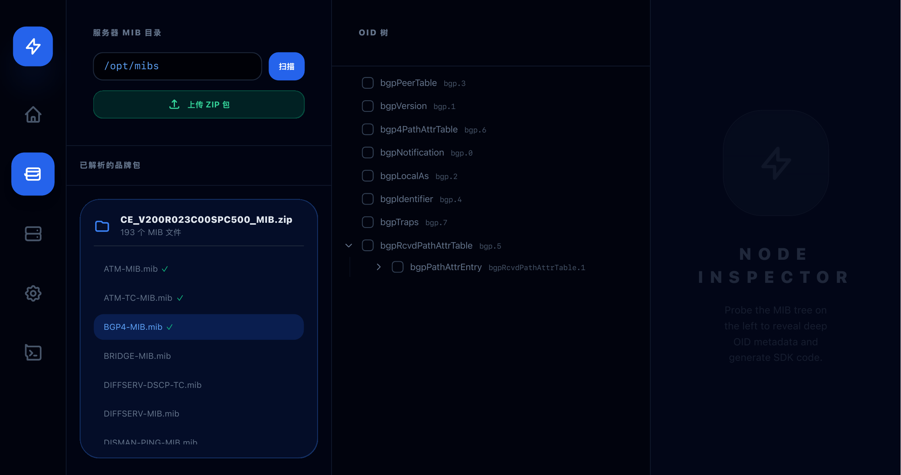
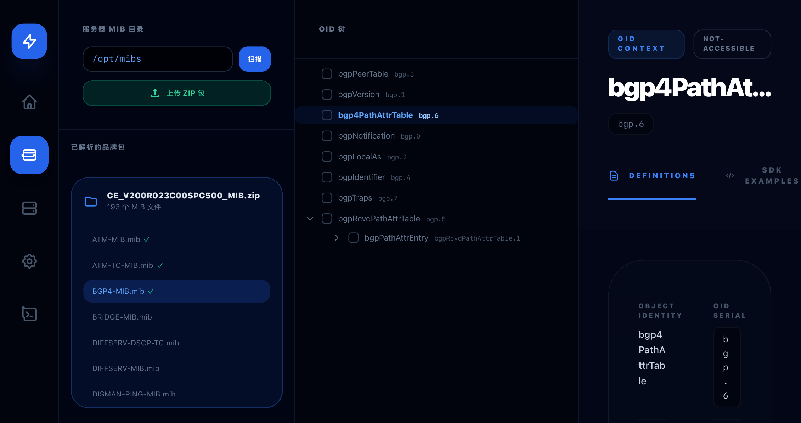
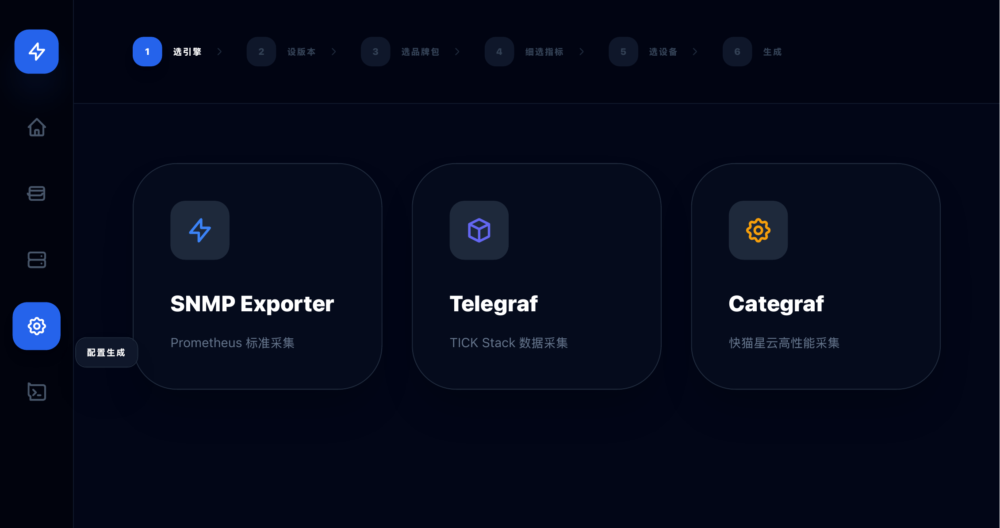
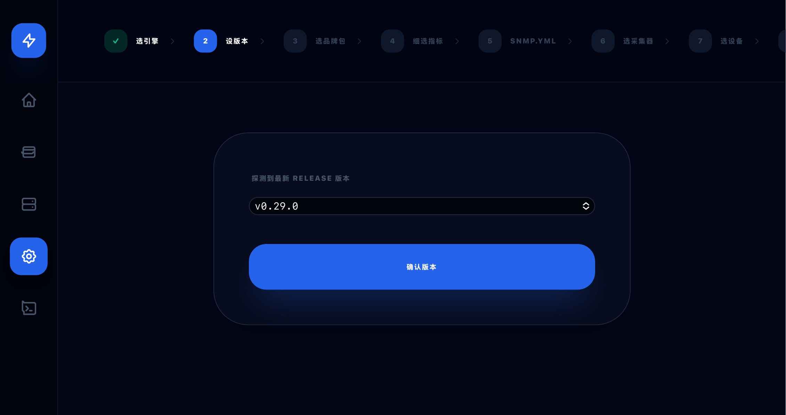
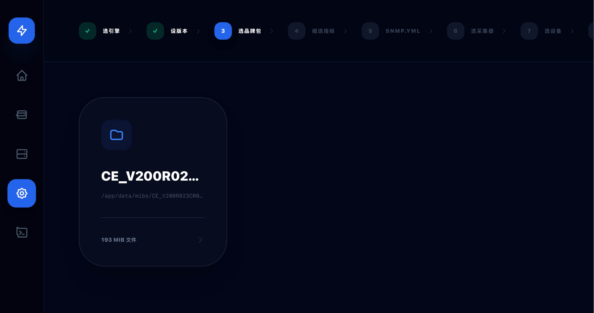
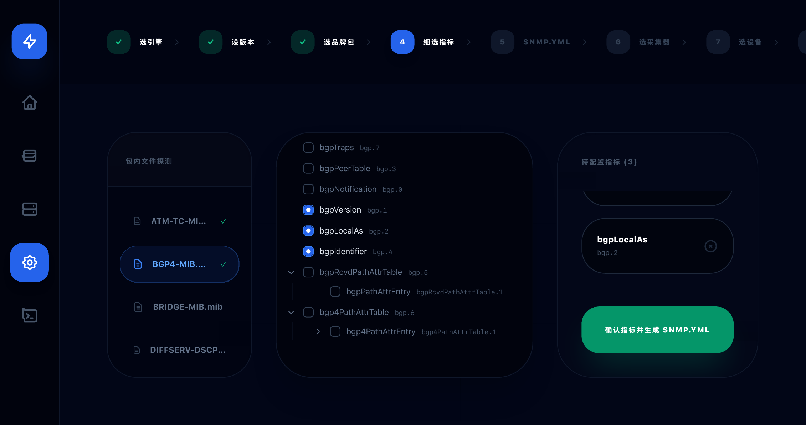
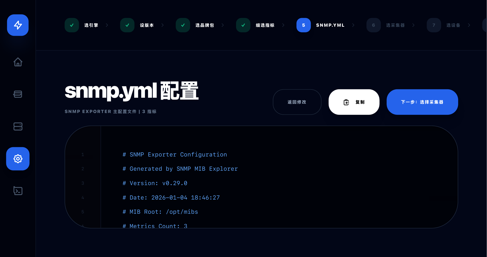

<div align="center">

# 🔥 SNMP MIB Explorer Pro

### 🚀 告别手写 SNMP 配置的痛苦！一站式可视化 SNMP 监控配置生成平台

[](LICENSE)
[](https://golang.org)
[](https://reactjs.org)
[](https://www.typescriptlang.org)
[](https://www.docker.com)
[](https://github.com/Oumu33/snmp-mib-ui/stargazers)

---

**⚡ 特性概览**

[](#) [](#) [](#) [](#)

</div>

---

## 📖 项目简介

<div align="center">

> 💡 **SNMP MIB Explorer Pro** 是一个专为网络运维工程师打造的**可视化 SNMP 监控配置生成工具**

</div>

通过直观的 Web 界面，你可以轻松：

- 📦 上传厂商 MIB 文件
- 🌳 浏览 OID 树形结构
- ✅ 选择需要采集的指标
- 🎯 一键生成多种采集引擎配置

---

## 🎯 解决的痛点

| 😰 痛点 | ✅ 解决方案 |
|--------|-----------|
| ❌ **手动翻阅 MIB 文档** - 在海量 MIB 文件中寻找 OID，耗时耗力 | 🌳 **可视化树形展示** - 点击展开，一目了然 |
| ❌ **配置文件格式复杂** - SNMP Exporter、Telegraf、Categraf 格式各不相同 | 🎯 **智能配置生成** - 一键生成，自动适配 |
| ❌ **厂商 MIB 管理混乱** - 不同厂商、不同版本的 MIB 文件难以统一管理 | 📦 **品牌包管理** - 按厂商分类，井井有条 |
| ❌ **设备资产管理困难** - 监控目标设备信息分散，难以维护 | 🖥️ **统一设备管理** - 批量导入，集中维护 |

---

## ⭐ 核心价值

<div align="center">


</div>

- ✅ **可视化选择** - 树形结构展示 MIB 文件，点击即可选择指标
- ✅ **智能生成** - 自动生成多种采集引擎的配置文件
- ✅ **品牌管理** - 按厂商分类管理 MIB 文件包
- ✅ **设备管理** - 统一管理监控目标设备信息
- ✅ **一键部署** - Docker 一键启动，开箱即用

---

## 🚀 核心特性

<div align="center">

### 🎨 功能矩阵

| 功能 | 状态 | 描述 |
|------|------|------|
| 🎯 **可视化 OID 选择** | ✅ | 树形结构展示 MIB 文件，支持搜索、展开/折叠 |
| ⚡ **多引擎支持** | ✅ | SNMP Exporter / Telegraf / Categraf 一网打尽 |
| 📱 **响应式设计** | ✅ | PC / 平板 / 手机全端适配 |
| 🔧 **智能配置生成** | ✅ | 自动生成 snmp.yml / prometheus.yml / vmagent.yml / telegraf.conf |
| 📦 **品牌包管理** | ✅ | 上传厂商 MIB 包（ZIP 格式），按品牌分类管理 |
| 🖥️ **设备资产管理** | ✅ | 统一管理监控目标设备，支持批量导入导出 |
| 🔍 **OID 信息展示** | ✅ | 显示 OID 名称、类型、访问权限、描述等详细信息 |
| 📋 **配置预览复制** | ✅ | 实时预览生成的配置文件，一键复制到剪贴板 |
| 🔬 **实时 SNMP 测试** | ✅ | 在 OID 详情页直接测试 SNMP GET，查看实时返回值和响应时间；内置使用向导，三步完成设备测试 |
| 🎨 **OID 智能推荐** | ✅ | 按分类（CPU、内存、网络等）快速筛选常用 OID 指标 |
| 🔎 **全局智能搜索** | ✅ | 跨所有 MIB 文件搜索 OID 名称、描述、语法，快速定位指标 |
| ✅ **配置验证优化** | ✅ | 自动检查 YAML 语法、重复 OID、采集开销，提供优化建议；支持实时验证配置参数 |
| 🔌 **SSH 远程配置** | ✅ | 支持 SSH 远程连接设备，检查 SNMP 状态，一键启用 SNMP 服务 |
| 🏷️ **多品牌支持** | ✅ | 支持华为、思科、H3C、Juniper、Arista、Fortinet、MikroTik、戴尔、惠普、Ruckus、Ubiquiti、TP-Link、D-Link、Netgear、Extreme、Brocade、ZTE、Nokia、Alcatel-Lucent 等多种品牌设备 |

</div>

---

## 🎬 工作流程

<div align="center">

### 📋 SNMP Exporter 配置流程

```
┌─────────────┐    ┌─────────────┐    ┌─────────────┐    ┌─────────────┐
│ 1.选择引擎  │ →  │ 2.设置版本  │ →  │ 3.选择品牌  │ →  │ 4.选择OID  │
└─────────────┘    └─────────────┘    └─────────────┘    └─────────────┘
                                                                   ↓
┌─────────────┐    ┌─────────────┐    ┌─────────────┐    ┌─────────────┐
│ 5.选择采集器│ →  │ 6.选择设备  │ →  │ 7.预览配置  │ →  │ 8.生成配置  │
└─────────────┘    └─────────────┘    └─────────────┘    └─────────────┘
```

### ⚡ Telegraf / Categraf 配置流程

```
┌─────────────┐    ┌─────────────┐    ┌─────────────┐    ┌─────────────┐
│ 1.选择引擎  │ →  │ 2.设置版本  │ →  │ 3.选择品牌  │ →  │ 4.选择OID  │
└─────────────┘    └─────────────┘    └─────────────┘    └─────────────┘
                                                                   ↓
┌─────────────┐    ┌─────────────┐    ┌─────────────┐
│ 5.选择设备  │ →  │ 6.预览配置  │ →  │ 7.生成配置  │
└─────────────┘    └─────────────┘    └─────────────┘
```

</div>

---

## 🖼️ 界面预览

<div align="center">

### 📸 功能截图

| 📁 MIB 目录扫描 | 🌳 OID 树详情 |
|----------------|---------------|
|  |  |

| ⚙️ 配置生成向导 | 📊 版本选择 |
|----------------|-------------|
|  |  |

| 📦 品牌包选择 | 🎯 指标选择 |
|----------------|-------------|
|  |  |

| 📝 SNMP 配置生成 | 🚀 采集器选择 |
|------------------|---------------|
|  |  |

</div>

---

## 🛠️ 快速开始

<div align="center">

### 🐳 Docker 一键部署（推荐 ⭐）

</div>

#### 🎯 模式 A：直接使用阿里云镜像

<div align="center">

> **适用场景**：快速部署、生产环境、不想本地构建

</div>

**✨ 优点：**
- ✅ 无需本地构建，开箱即用
- ✅ 阿里云镜像源，国内访问速度快
- ✅ 镜像经过优化，体积小（后端 35.1MB，前端 62.2MB）

```bash
# 🔥 一键启动
git clone https://github.com/Oumu33/snmp-mib-ui.git
cd snmp-mib-ui
docker-compose up -d

# 🌐 访问应用
# 浏览器打开 http://localhost:3000
```

**📊 服务信息：**
| 服务 | 地址 | 说明 |
|------|------|------|
| 🖥️ 前端 | http://localhost:3000 | Nginx + React |
| ⚙️ 后端 | http://localhost:8080 | Go API |
| 💾 数据 | ./data | MIB 文件和 SQLite 数据库 |

**🔧 常用命令：**
```bash
# 查看日志
docker-compose logs -f

# 停止服务
docker-compose down

# 重启服务
docker-compose restart

# 更新镜像并重启
docker-compose pull && docker-compose up -d
```

**📦 镜像信息：**
- 🐳 **后端**: `registry.cn-hangzhou.aliyuncs.com/snmp-mib/snmp-mib-explorer-pro-backend:latest` (35.1MB)
- 🐳 **前端**: `registry.cn-hangzhou.aliyuncs.com/snmp-mib/snmp-mib-explorer-pro-frontend:latest` (62.2MB)

---

#### 🔨 模式 B：从本地源码构建

<div align="center">

> **适用场景**：需要自定义修改代码、调试或学习源码

</div>

```bash
# 1. 克隆项目
git clone https://github.com/Oumu33/snmp-mib-ui.git
cd snmp-mib-ui

# 2. 修改 docker-compose.yml
# 注释掉 image 行，取消注释 build 配置

# 3. 构建并启动
docker-compose up -d --build
```

> 💡 **提示**：本地构建需要较长时间，建议使用模式 A

---

## 📖 使用指南

### 1️⃣ 上传 MIB 文件包

```bash
📁 步骤：
1. 点击"品牌包管理"标签页
2. 点击"上传品牌包"按钮
3. 选择厂商的 MIB 文件包（ZIP 格式）
4. 输入品牌名称和描述
5. 点击上传
```

**📋 MIB 文件包要求：**
- 📦 文件格式：ZIP 压缩包
- 📄 内容：包含 `.mib` 或 `.my` 文件
- 💡 建议：按厂商分类打包，如 `HUAWEI.zip`、`CISCO.zip`

---

### 2️⃣ 添加设备信息

```bash
🖥️ 步骤：
1. 点击"设备管理"标签页
2. 点击"添加设备"按钮
3. 填写设备信息：
   - 设备名称
   - IP 地址
   - SNMP 版本（v1/v2c/v3）
   - Community 字符串或 v3 认证信息
   - SSH 凭据（可选，用于远程配置 SNMP）
     * SSH 用户名
     * SSH 密码
     * SSH 端口（默认 22）
4. 保存设备
```

**📋 CSV 批量导入格式：**

```csv
Name,IP,Port,Version,Community,v3User,v3Level,v3AuthProto,v3AuthPass,v3PrivProto,v3PrivPass,SSHUsername,SSHPassword,SSHPort
CORE-SW-01,192.168.1.1,161,v2c,public,,,,,,,,root,admin123,22
CORE-SW-02,192.168.1.2,161,v3,,snmp_user,authPriv,SHA,auth123,AES,priv123,admin,pass456,22
```

**📝 CSV 字段说明：**

| 字段 | 说明 | 必填 | 默认值 |
|------|------|------|--------|
| Name | 设备名称 | ✅ | - |
| IP | 设备 IP 地址 | ✅ | - |
| Port | SNMP 端口 | ❌ | 161 |
| Version | SNMP 版本（v1/v2c/v3） | ❌ | v2c |
| Community | v2c 团体名字符串 | ❌ | public |
| v3User | v3 安全名称 | ❌ | - |
| v3Level | v3 安全级别 | ❌ | - |
| v3AuthProto | v3 认证协议 | ❌ | - |
| v3AuthPass | v3 认证密码 | ❌ | - |
| v3PrivProto | v3 加密协议 | ❌ | - |
| v3PrivPass | v3 加密密码 | ❌ | - |
| SSHUsername | SSH 用户名 | ❌ | - |
| SSHPassword | SSH 密码 | ❌ | - |
| SSHPort | SSH 端口 | ❌ | 22 |

**💡 提示：**
- SSH 凭据为可选项，用于远程配置 SNMP 服务
- 如果需要使用 SSH 远程配置功能，请填写 SSH 凭据
- CSV 文件支持 UTF-8 编码，第一行为表头
- 可以点击"Export"按钮导出当前设备列表作为模板

---

### 3️⃣ 动态扫描 MIB 目录

<div align="center">

> 📁 支持扫描服务器上已有的 MIB 目录

</div>

**🔍 文件夹浏览功能：**

```
/opt/mibs/
├── 📁 HUAWEI/
│   ├── 📦 CE_V200R023.zip
│   ├── 📦 NE40E.zip
│   └── 📦 S12700.zip
├── 📁 CISCO/
│   ├── 📦 IOS-XR.zip
│   └── 📦 Nexus.zip
└── 📁 H3C/
    ├── 📦 S12500.zip
    └── 📦 S5130.zip
```

**⚙️ 自定义 MIB 路径：**

```bash
# 支持扫描宿主机的任意路径
/opt/mibs
/home/user/mibs
/var/lib/snmp
/data/custom/mibs
```

---

### 4️⃣ 生成配置文件

```bash
🎯 步骤：
1. 点击"配置生成器"标签页
2. 选择采集引擎（SNMP Exporter / Telegraf / Categraf）
3. 设置 SNMP 版本参数
4. 选择品牌包
5. 树形浏览 MIB 文件，勾选需要采集的 OID
6. 选择目标设备
7. 点击"生成配置"
8. 预览并复制配置文件
```

---

### 5️⃣ SSH 远程配置 SNMP

<div align="center">

> 🔌 支持通过 SSH 远程连接设备，检查 SNMP 服务状态，一键启用 SNMP 服务

</div>

**🏷️ 支持的品牌：**
- 🇨🇳 华为 (Huawei) - VRP 系统
- 🇺🇸 思科 (Cisco) - IOS/IOS-XR 系统
- 🇨🇳 H3C - Comware 系统
- 🇺🇸 Juniper - JunOS 系统
- 🇺🇸 Arista - EOS 系统
- 🇨🇦 Fortinet - FortiOS 系统
- 🇱🇻 MikroTik - RouterOS 系统
- 🇺🇸 戴尔 (Dell) - PowerConnect 系统
- 🇺🇸 惠普 (HP) - ProCurve 系统
- 💻 通用 Linux - net-snmp

**🔧 使用步骤：**

```bash
📝 步骤：
1. 点击"设备管理"标签页
2. 在设备卡片上点击绿色 SSH 按钮
3. 输入 SSH 凭据：
   - SSH 用户名
   - SSH 密码
   - SSH 端口（默认 22）
4. 点击"测试SSH连接"验证连接
5. 点击"自动检测"按钮自动识别设备品牌
6. 点击"检查SNMP状态"查看设备 SNMP 服务状态
7. 如果 SNMP 未运行，点击"一键启用SNMP"
8. 配置 SNMP 参数：
   - SNMP 版本（v2c/v3）
   - Community 字符串
   - v3 认证信息（如选择 v3）
   - 系统信息（名称、位置、联系人）
9. 点击"启用SNMP"完成配置
```

**⚙️ SNMP 配置说明：**

| 参数 | 说明 | 默认值 |
|------|------|--------|
| 版本 | SNMP 协议版本 | v2c |
| Community | v2c 团体名字符串 | public |
| 安全名称 | v3 用户名 | - |
| 认证协议 | v3 认证算法（MD5/SHA/SHA256/SHA512） | SHA |
| 认证密码 | v3 认证密码 | - |
| 加密协议 | v3 加密算法（DES/AES/AES192/AES256） | AES |
| 加密密码 | v3 加密密码 | - |
| 系统名称 | 设备系统名称 | 设备 IP |
| 位置 | 设备物理位置 | Unknown |
| 联系人 | 管理员联系方式 | admin@example.com |

**🔍 品牌检测：**

系统会自动检测设备品牌，使用对应厂商的命令进行 SNMP 配置：

- **华为**: `display version` → `snmp-agent community`
- **思科**: `show version` → `snmp-server community`
- **H3C**: `display version` → `snmp-agent community`
- **Juniper**: `show version` → `set system snmp`
- **Arista**: `show version` → `snmp-server community`
- **Fortinet**: `get system status` → `set system snmp`
- **MikroTik**: `/system resource print` → `/snmp set`
- **戴尔**: `show version` → `snmp-server community`
- **惠普**: `show version` → `snmp-server community`
- **通用 Linux**: `uname -a` → `/etc/snmp/snmpd.conf`

**⚠️ 注意事项：**

- 确保 SSH 服务已启用并可访问
- 确保使用的账户有足够的权限执行 SNMP 配置命令
- 部分设备可能需要进入特权模式（enable）或配置模式（configure terminal）
- 配置完成后建议保存配置（save/write memory）
- 建议在测试环境先验证配置命令

---

## 🐳 Docker 镜像

<div align="center">

### 📦 阿里云镜像（推荐国内用户 ⭐）

| 镜像 | 地址 | 大小 | 说明 |
|------|------|------|------|
| 🐳 **后端** | `registry.cn-hangzhou.aliyuncs.com/snmp-mib/snmp-mib-explorer-pro-backend:latest` | 35.1MB | Go 语言构建，轻量高效 |
| 🐳 **前端** | `registry.cn-hangzhou.aliyuncs.com/snmp-mib/snmp-mib-explorer-pro-frontend:latest` | 62.2MB | React + Nginx，静态资源服务 |

```bash
# 🚀 拉取命令
docker pull registry.cn-hangzhou.aliyuncs.com/snmp-mib/snmp-mib-explorer-pro-backend:latest
docker pull registry.cn-hangzhou.aliyuncs.com/snmp-mib/snmp-mib-explorer-pro-frontend:latest
```

</div>

---

## 📂 项目结构

```
snmp-mib-explorer-pro/
├── 🐳 docker-compose.yml          # Docker Compose 配置文件
├── 🔧 .env.example               # 环境变量示例
├── 📝 .gitignore                 # Git 忽略文件
├── 📖 README.md                  # 项目文档
├── ⚙️ backend/                   # Go 后端服务
│   ├── 🐳 Dockerfile             # 后端镜像构建文件
│   ├── 📦 go.mod                 # Go 模块依赖
│   ├── 🔒 go.sum                 # Go 依赖版本锁定
│   ├── 🚀 main.go                # 后端入口文件
│   ├── 📁 internal/              # 内部包
│   │   ├── 🎯 handler/           # HTTP 请求处理器
│   │   │   ├── handler.go        # 主处理器
│   │   │   └── extended.go       # 扩展处理器
│   │   ├── 💼 service/           # 业务逻辑层
│   │   │   ├── generator.go      # 配置生成服务
│   │   │   ├── github.go         # GitHub 版本查询服务
│   │   │   └── preset.go         # 预设数据服务
│   │   ├── 📊 model/             # 数据模型
│   │   │   └── model.go          # 数据结构定义
│   │   └── 🕷️ snmp/              # SNMP 相关
│   │       └── client.go         # SNMP 客户端
│   └── 💾 data/                  # 数据目录
│       ├── 📄 app.db             # SQLite 数据库
│       └── 📁 mibs/              # MIB 文件存储
├── 🎨 frontend/                  # React 前端应用
│   ├── 🐳 Dockerfile             # 前端镜像构建文件
│   ├── 🌐 nginx.conf             # Nginx 配置文件
│   ├── 📦 package.json           # Node.js 依赖
│   ├── ⚙️ tsconfig.json          # TypeScript 配置
│   ├── 🚀 vite.config.ts         # Vite 构建配置
│   ├── 📄 index.html             # HTML 入口
│   ├── 🎯 index.tsx              # React 入口
│   ├── 🎨 App.tsx                # 主应用组件
│   ├── 📝 types.ts               # TypeScript 类型定义
│   ├── 🧩 components/            # UI 组件
│   │   ├── ConfigGenerator.tsx   # 配置生成器组件
│   │   ├── DeviceManager.tsx     # 设备管理组件
│   │   ├── Icons.tsx             # 图标组件
│   │   ├── MibTreeView.tsx       # MIB 树形视图组件
│   │   └── OidDetails.tsx        # OID 详情组件
│   └── 📡 services/              # 服务层
│       ├── api.ts                # API 调用服务
│       ├── githubService.ts      # GitHub 服务
│       ├── localConfigService.ts # 本地配置服务
│       ├── mibParser.ts          # MIB 解析服务
│       └── presetData.ts         # 预设数据
└── 💾 data/                      # 数据持久化目录
    ├── 📄 app.db                 # SQLite 数据库
    └── 📁 mibs/                  # MIB 文件存储
```

---

## 🔧 技术栈

<div align="center">

### ⚙️ 后端

| 技术 | 版本 | 用途 |
|------|------|------|
| 🐹 Go | 1.23+ | 后端语言 |
| 🚀 Gin | - | Web 框架 |
| 💾 SQLite | - | 数据库 |
| 🕷️ net-snmp | - | MIB 解析 |
| 🐳 Docker | - | 容器化 |

### 🎨 前端

| 技术 | 版本 | 用途 |
|------|------|------|
| ⚛️ React | 18+ | UI 框架 |
| 📘 TypeScript | 5+ | 类型安全 |
| 🚀 Vite | - | 构建工具 |
| 🎨 Bootstrap 5 | - | UI 组件库 |
| 🎨 Material Design | - | 设计风格 |

</div>

---

## 🤝 贡献指南

<div align="center">

> 🎉 欢迎贡献代码、报告问题或提出建议！

</div>

### 📋 贡献流程

```bash
1. 🍴 Fork 本仓库
2. 🌿 创建特性分支 (git checkout -b feature/AmazingFeature)
3. 💾 提交更改 (git commit -m 'Add some AmazingFeature')
4. 📤 推送到分支 (git push origin feature/AmazingFeature)
5. 🔀 提交 Pull Request
```

### 📝 代码规范

- **后端**: 遵循 [Go Code Review Comments](https://github.com/golang/go/wiki/CodeReviewComments)
- **前端**: 遵循 [React 官方文档](https://react.dev/learn) 最佳实践
- **提交信息**: 遵循 [Conventional Commits](https://www.conventionalcommits.org/)

---

## 📄 License

<div align="center">

本项目采用 **MIT 许可证** - 详见 [LICENSE](LICENSE) 文件

</div>

---

## 🙏 致谢

<div align="center">

感谢以下开源项目：

| 项目 | 用途 |
|------|------|
| [Gin](https://github.com/gin-gonic/gin) | Go Web 框架 |
| [React](https://react.dev/) | UI 框架 |
| [Vite](https://vitejs.dev/) | 前端构建工具 |
| [Bootstrap](https://getbootstrap.com/) | UI 组件库 |
| [SNMP Exporter](https://github.com/prometheus/snmp_exporter) | Prometheus SNMP 采集器 |

</div>

---

## 📮 联系方式

<div align="center">

| 方式 | 链接 |
|------|------|
| 💬 GitHub Issues | [提交问题](https://github.com/Oumu33/snmp-mib-ui/issues) |
| 📧 Email | oumu33@github.com |

---

<div align="center">

## ⭐ 如果这个项目对你有帮助，请给个 Star！⭐

Made with ❤️ by Oumu33

</div>

</div>